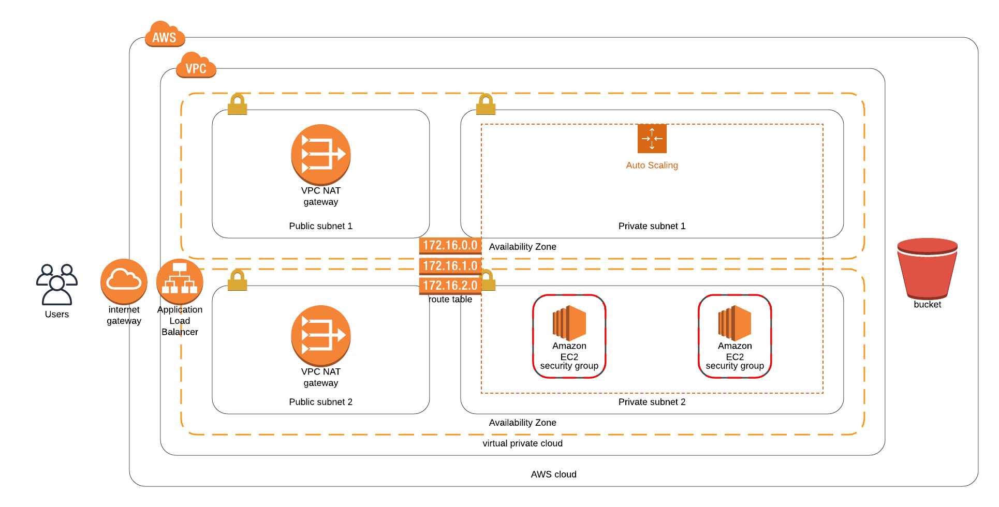

# Deploy a high-availability web app using CloudFormation

In this project, we’ll deploy web servers for a highly available web app using CloudFormation. 

It contains `Cloudformation templates` that will create and deploy the infrastructure and application for Instagram-like app from the ground up. 

The deployment will be carried out in such a way that the networking components followed by servers, security roles and software are deployed in that order.