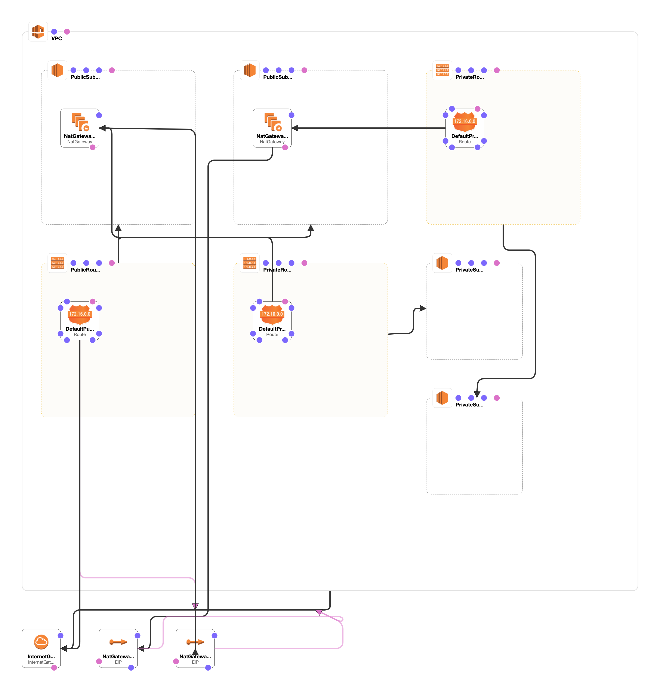
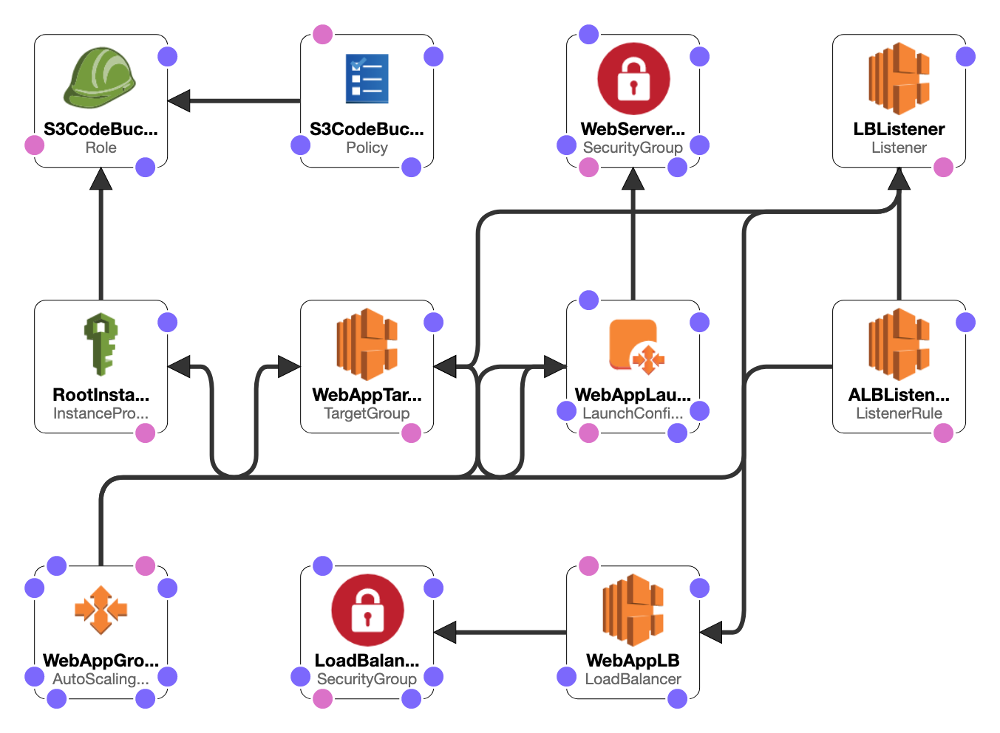

# Deploy a high-availability web app using CloudFormation


In this project, we’ll deploy web servers for a highly available web app using CloudFormation. 

It contains `Cloudformation templates` that will create and deploy the infrastructure and application for Instagram-like app from the ground up. 

The deployment will be carried out in such a way that the networking components followed by servers, security roles and software are deployed in that order.

## Template Designer Diagrams

### Network Architecture




### Servers Architecture


## Running

1. Update the parameters in the files present in the `data/` directory to suit your purpose.

2. Create the network stack

    ```
        $ ./scripts/create-stack.sh CfnBase CfnNetwork.yml data/network-parameters.json
    ```

3. Create the servers stack

    ```
        $ ./scripts/create-stack.sh CfnServers CfnServers.yml data/servers-parameters.json
    ```